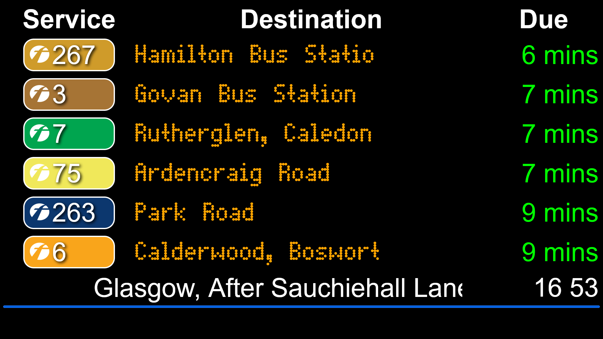

# BusTimes



A real-time bus departure board for the city of Glasgow

> 🚧 This is a work in progress!

## Develop

```sh
git clone https://github.com/fengshuo2004/BusTimes.git
cd BusTimes
npm install
node .
```

## Support

Currently this program does **not** rely on UK Government's NaPTAN API, instead bus times are scraped off websites of the respective companies. This way, more bus services appear as live-tracked.

With such limitation in mind, below are the bus operators we intend to support in the short term. Bus services by these ticked companies are currently track-able in the program.

- [x] First Bus
- [x] West Coast Motors
- [x] Midland Bluebird & Eastern Scottish
- [ ] McGill's
- [ ] Stagecoach
- [ ] JMB Travel
